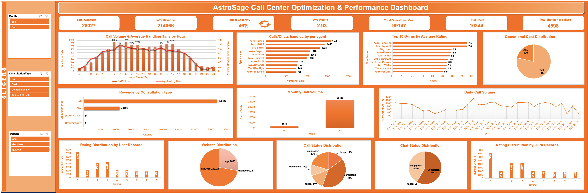
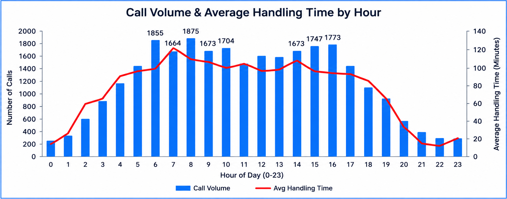
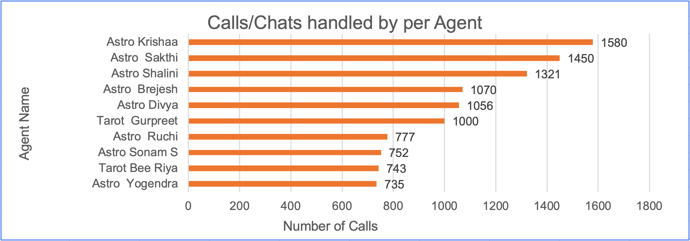
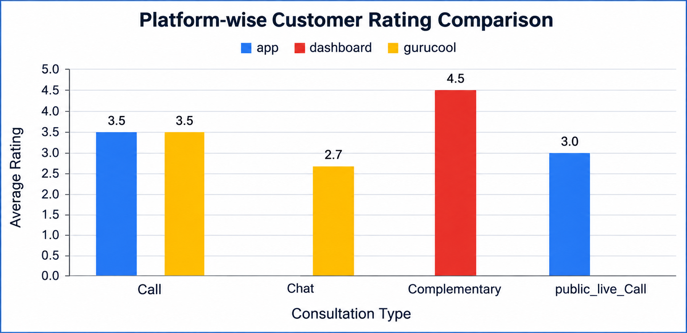
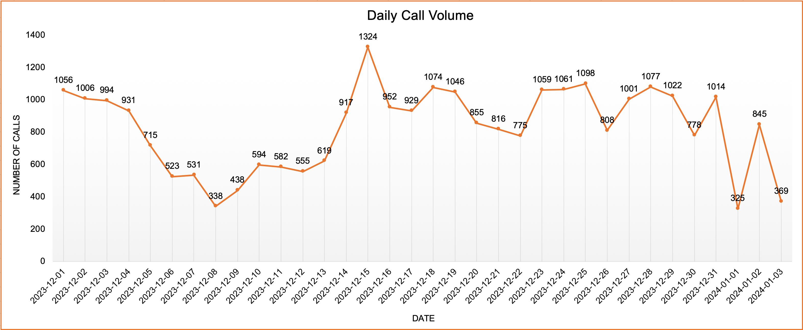

# AstroSage Customer Support Analytics & Performance Dashboard

## Project Overview

This project focuses on analyzing AstroSage customer support and call center data to understand operational performance, customer satisfaction, revenue, costs, and workload patterns.

The analysis was done using Excel to identify important business trends and provide recommendations for better resource allocation and operational improvement.

## Business Problem

AstroSage has received an investment of ₹1 crore and wants to improve its call center operations. The key challenge is to decide how this investment should be allocated effectively.

The company aims to:

- Improve operational efficiency.
- Enhance customer satisfaction.
- Increase overall profitability.

## Project Objective

The main objective of this analysis was to understand the current performance of the call center and identify areas where the investment can create the most value.

The analysis focused on:

- Understanding call volume and demand patterns.
- Identifying peak call hours.
- Analyzing agent workload and performance.
- Understanding customer satisfaction.
- Analyzing revenue and operational costs.
- Studying repeat callers and customer behavior.
- Comparing platforms and consultation types.
- Identifying operational risks.
- Providing recommendations for the ₹1 crore investment.

## Dataset Overview

The dataset is a historical customer support call-center dataset containing information related to:

- Call activity
- Call duration
- Agent performance
- Customer ratings
- Revenue
- Cost
- Consultation type
- Platform
- Customer and caller activity

The dataset contains 29 attributes covering both categorical and numerical information.

## Data Cleaning

Before performing the analysis, I cleaned and prepared the data for analysis.

The main steps included:

- Checking and removing duplicate records.
- Handling missing values.
- Converting text values into appropriate numerical formats.
- Correcting date and time formats.
- Rounding numerical values where required.
- Separating combined information into useful columns.
- Removing unnecessary columns.
- Validating the cleaned data before analysis.

## Analysis Performed

### 1. Call Volume Analysis

I analyzed daily, monthly, and hourly call volumes to understand customer demand patterns.

This helped identify periods with high and low call activity and provided a better understanding of how demand changes over time.

### 2. Peak Hour Analysis

I analyzed call volume by hour to identify the busiest periods.

The analysis showed the highest call volumes during:

- 8 AM
- 6 AM
- 4 PM
- 3 PM
- 10 AM

These patterns can help in planning staffing and resource allocation during high-demand periods.

### 3. Agent Workload Analysis

I analyzed the number of calls handled by individual agents along with their average call duration.

This helped identify differences in workload between agents and areas where workload balancing may be required.

### 4. Customer Satisfaction Analysis

I analyzed customer ratings and studied their relationship with call duration, spending, platforms, and other factors.

The analysis showed that longer interactions generally had better ratings, while shorter interactions were more commonly associated with lower ratings.

I also compared customer satisfaction across different platforms.

### 5. Revenue and Cost Analysis

I analyzed revenue generated from different consultation types and studied operational costs.

The analysis helped identify areas with higher revenue contribution and understand how costs were distributed across call center operations.

### 6. Repeat Customer Analysis

I analyzed repeat callers to understand customer behavior and identify the importance of customer retention.

The analysis identified 1,478 repeat callers, representing approximately 46% of total callers.

### 7. Platform and Consultation Analysis

I compared customer activity, ratings, and performance across different platforms and consultation types.

This helped identify differences in customer experience and business performance across channels.

### 8. Risk Analysis

I compared call volumes, costs, and cost per call across different periods to identify operational risks.

The analysis showed significant variation in call volume between months, which highlights the need for flexible staffing and resource planning.

## Key Findings

Some of the major findings from the analysis were:

- Call volume varies significantly across different days, months, and hours.
- December had the highest monthly call volume, while January had the lowest.
- Peak-hour demand creates a need for better staffing and workload planning.
- Agent workload is not evenly distributed.
- Customer satisfaction varies across platforms.
- Gurucool had a lower average customer rating compared with some other platforms.
- Repeat callers form a significant portion of the customer base.
- Call consultations generate higher revenue compared with chat consultations.
- Operational costs are mainly associated with call-based support.
- Higher spending does not always result in higher customer satisfaction.
- Customer satisfaction and call duration showed a moderate positive relationship.

## Dashboard

I created an interactive Excel dashboard to bring the main findings together in one place.

The dashboard includes:

- KPI summary cards
- Total consultations
- Total revenue
- Repeat caller percentage
- Average customer rating
- Total cost
- Total users
- Total callers
- Hourly call analysis
- Agent workload analysis
- Cost distribution
- Customer rating analysis
- Monthly and daily call trends
- Revenue analysis
- Website/platform analysis
- Call and chat status analysis

### Dashboard Preview

### Peak Call Hours

### Agent Workload

### Customer Satisfaction

### Daily Call Volume

## Business Recommendations

Based on the analysis, I recommended focusing the investment on the following areas:

### 1. AI and Automation

Use AI-based chatbots and automation to handle repetitive customer queries and reduce pressure on the call center.

### 2. Agent Training

Invest in agent training and customer-handling skills to improve service quality and customer satisfaction.

### 3. CRM and Analytics

Improve customer data management using CRM systems and analytics to better understand customer behavior and support decision-making.

### 4. Call Quality and Performance Monitoring

Use call quality monitoring and speech analytics to identify service issues and improve customer interactions.

### 5. Workload and Staffing Optimization

Use call volume and peak-hour trends to plan staffing according to customer demand and reduce workload imbalance.

## ₹1 Crore Investment Allocation

Based on the analysis, the proposed allocation of the ₹1 crore investment was:

| Area  |  Allocation |

| AI & Chatbots | ₹30 lakh |
| Agent Training | ₹25 lakh |
| CRM & Customer Analytics | ₹20 lakh |
| Call Quality & Analytics | ₹15 lakh |
| Infrastructure | ₹10 lakh |
| **Total** | **₹1 crore** |

The allocation prioritizes technology, employee capability, customer management, and performance monitoring to support operational efficiency, customer satisfaction, and profitability.

## Tools & Techniques

### Tools

- Microsoft Excel
- Pivot Tables
- Excel Charts
- Slicers
- Excel Formulas

### Analysis Techniques

- Data Cleaning
- Exploratory Data Analysis
- Trend Analysis
- Customer Analysis
- Agent Performance Analysis
- Revenue & Cost Analysis
- Correlation Analysis
- KPI Analysis
- Business Recommendation

## Project Files

- `AstroSage_Customer_Support_Analytics.xlsx` — Complete Excel workbook containing data preparation, analysis, calculations, and dashboard.
- `AstroSage_Customer_Support_Analysis_Presentation.pptx` — Project presentation covering the analysis, findings, and recommendations.
- `AstroSage_Customer_Support_Analytics_Report.docx` — Detailed project report documenting the analysis and findings.

## Conclusion

This project helped me analyze customer support operations from both a data and business perspective.

The analysis identified important patterns in call volume, agent workload, customer satisfaction, revenue, cost, and customer behavior.

Based on these findings, I proposed practical improvements in AI automation, agent training, CRM, call quality monitoring, and workload planning, along with a ₹1 crore investment allocation to support the company's business objectives.
